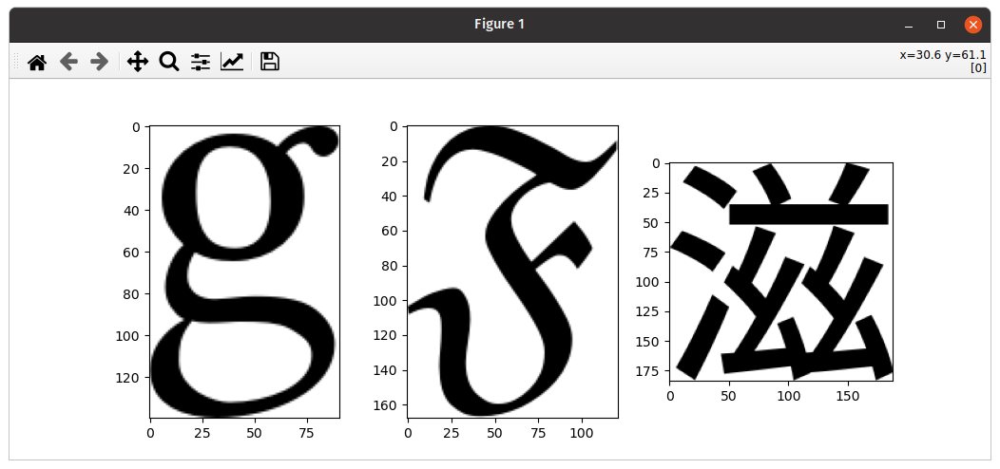

# Bibliothèque freetype

Cette bibliothèque unitaire illustre l'utilisation de Cython pour construire une API vers une bibliothèque C.

## Installation de la bibliothèque

```bash
pip install .
```

## Utilisation de la bibliothèque

```bash
python sample.py
```


